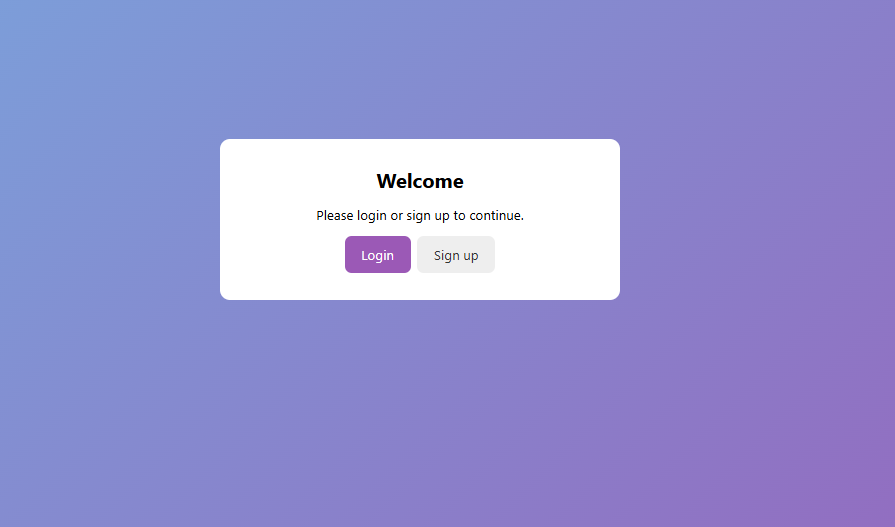
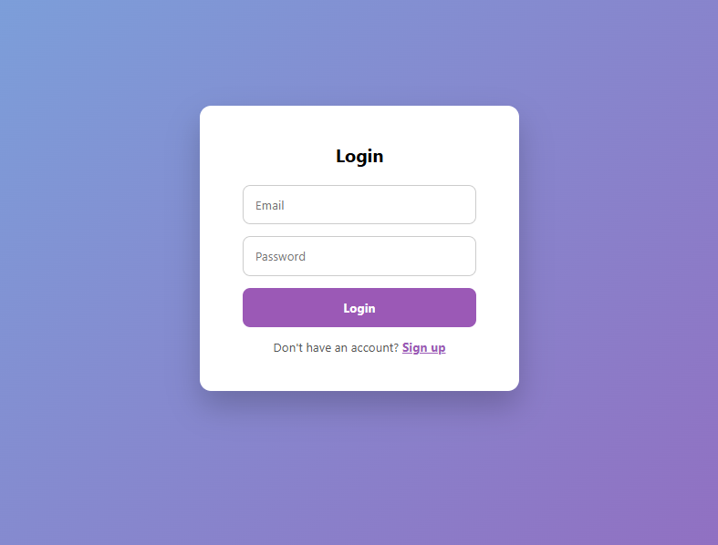
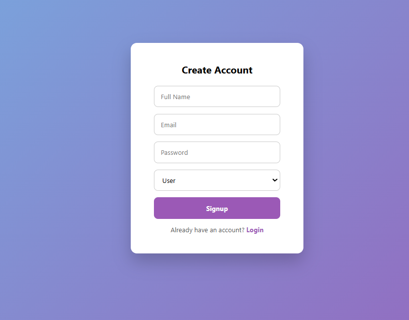
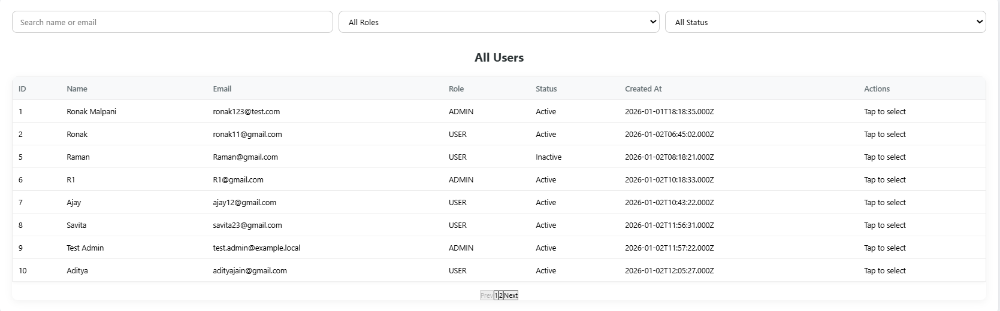
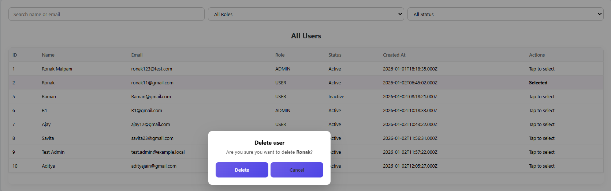
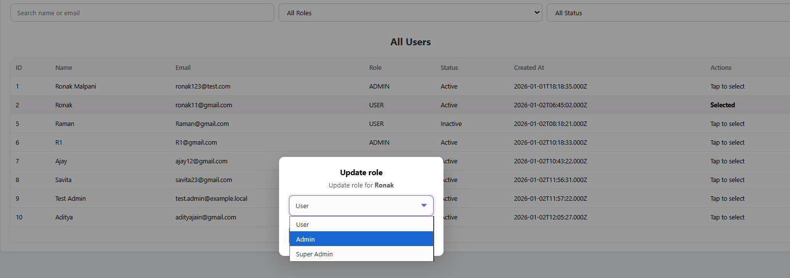
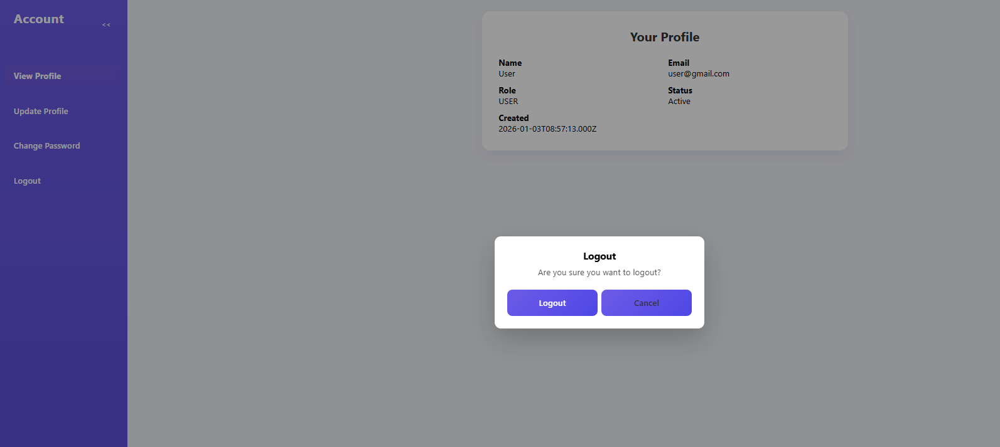

# User Management System (Role-Based Dashboard)

[](https://user-dashboard-app-jet.vercel.app)


A full-stack User Management System built as part of a technical round assignment. The application demonstrates authentication, authorization, and role-based access control (RBAC) using modern web technologies.

[Click Here to View Live Demo](https://user-dashboard-app-jet.vercel.app)
---

## Table of Contents
- [Tech Stack](#tech-stack)
- [Features](#features)
- [Project Structure](#project-structure)
- [Setup Instructions](#setup-instructions)
- [Demo Credentials](#demo-credentials-for-testing)
- [Screenshots](#screenshots--demo)
- [License](#license)

---

## Tech Stack

| Area | Technologies |
| :--- | :--- |
| **Frontend** | React.js, React Router, Axios, CSS3 (Responsive) |
| **Backend** | Node.js, Express.js, JWT, Bcrypt |
| **Database** | MySQL (Hosted on **Aiven Cloud**) |
| **Deployment** | **Vercel** (Frontend), **Render** (Backend) |


## Deployment

The application is deployed using a modern cloud infrastructure:

## Deployment

The application is deployed using a modern cloud infrastructure:

- **Frontend:** Deployed on **[Vercel](https://user-dashboard-app-jet.vercel.app)** for fast, global content delivery.
- **Backend:** Hosted as a web service on **[Render](https://render.com/)**, managing API requests and environment variables.
- **Database:** Managed MySQL instance hosted on **[Aiven](https://aiven.io/)**, configured with SSL for secure cloud connectivity.
---

## Features

### Authentication
* Secure Login & Registration
* JWT-based session management
* Bcrypt password hashing for security

### Role-Based Access Control (RBAC)

| Role         | Permissions                                                                                   | 
| -----------  | --------------------------------------------------------------------------------------------- |
| User         | • View Profile <br> • Update Profile <br> • Change Password                                   |
| Admin        | • All User privileges<br>                                                                     |
|              | •View all users <br>                                                                          |
|              | •Create/Edit users <br>                                                                       |
|              | • Activate/Deactivate accounts<br>                                                            |
| Super Admin  | • All Admin privileges <br> • Manage Roles (Promote/Demote Users & Admins)                    |

###  Demo Credentials (for testing)
| Role        | Email                                               | Password      |
| ----------- | --------------------------------------------------- | ------------- |
| Super Admin | [superadmin@gmail.com](mailto:superadmin@gmail.com) | SuperAdmin123 |
| Admin       | [admin@gmail.com](mailto:admin@gmail.com)           | Admin@123     |
| User        | [user@gmail.com](mailto:user@gmail.com)             | Userst@123    |


## Project Structure

```text
User Management System
├── client
│   ├── public
│   └─ src
│      ├── api           # Axios setup
│      ├── components    # Reusable UI (Sidebar, Modal, etc.)
│      ├── pages         # Dashboard views (Admin, User, Login)
│      └─ styles         # CSS Modules
│
├── server
│   ├── config           # DB connection & hashing logic
│   ├── controllers      # Business logic (Auth, User operations)
│   ├── middleware       # JWT Verification & Admin Checks
│   └─ routes            # API Endpoints
│
├── screenshots          # Images for README
└── README.md

```

##  REST API Documentation

Below are the key REST APIs used in this application.

###  Authentication
| Method | Endpoint       | Description               |
|------  |----------------|-------------------------- |
| POST   | /auth/login    | Login user and return JWT |
| POST   | /auth/register | Register new user         |

###  User APIs
| Method | Endpoint               | Description                |
|------  |------------------------|----------------------------|
| GET    | /users/profile         | Get logged-in user profile |
| PUT    | /users/profile         | Update user profile        |
| PUT    | /users/change-password | Change user password       |

###  Admin APIs (Admin / Super Admin only)
| Method | Endpoint          | Description                |
|------  |------------------ |----------------------------|
| GET    | /users            | Get all users              |
| POST   | /users            | Create new user            |
| PUT    | /users/:id        | Update user                |
| DELETE | /users/:id        | Delete user                |
| PUT    | /users/:id/role   | Update user role           |
| PUT    | /users/:id/status | Activate / Deactivate user |


## Setup Instructions

### 1. Clone the repository
```
git clone https://github.com/Ronak-malpani/user-dashboard-app.git
cd user-dashboard-app
```
### 2.Database Setup

The app uses MySQL. The database schema is provided in:
```
/database/schema.sql
```

To create the database and table, run:
```
mysql -u root -p < database/schema.sql
```

Enter your MySQL password when prompted.

### 2. Backend Setup

Install dependencies and configure the environment:
```
cd server
npm install
```

### Create a .env file in the server/ folder:
```
PORT=5000
DB_HOST=localhost
DB_USER=root
DB_PASSWORD=your_mysql_password
DB_NAME=user_management
JWT_SECRET=your_secret_key

Run the server: node server.js
```
Note: Replace your_mysql_password with the password of your local MySQL database.

### 3. Frontend Setup
```
Open a new terminal window:

cd client
npm install
npm start

The app will run on http://localhost:3000
```
##  Running Locally (Important Note)

This project uses a MySQL database.

## To run locally, you must:
```
- Have MySQL installed
- Create the required database and tables
- Configure environment variables in a `.env` file
```

## For reviewers:  
```
Please use the **live deployed application** using the demo credentials below.  
Local setup is provided for reference only.
```

### 4. Screenshots

### Authentication

**Landing Page**


**Login Page**


**Sign Up Page**


---

### Admin Dashboard

**Dashboard Overview**


**View All Users**


**Add User**


**Edit User**


**Delete User**


**Update Roles**


---

### User Dashboard

**User Overview**


**Profile Update**


**Change Password**


**Logout**


### 5.License
```
MIT License

Copyright (c) 2026 Ronak Malpani

Permission is hereby granted, free of charge, to any person obtaining a copy of this software and associated documentation files (the "Software"), to deal in the Software without restriction, including without limitation the rights to use, copy, modify, merge, publish, distribute, sublicense, and/or sell copies of the Software, and to permit persons to whom the Software is furnished to do so, subject to the following conditions:

The above copyright notice and this permission notice shall be included in all copies or substantial portions of the Software.

THE SOFTWARE IS PROVIDED "AS IS", WITHOUT WARRANTY OF ANY KIND, EXPRESS OR IMPLIED, INCLUDING BUT NOT LIMITED TO THE WARRANTIES OF MERCHANTABILITY, FITNESS FOR A PARTICULAR PURPOSE AND NONINFRINGEMENT. IN NO EVENT SHALL THE AUTHORS OR COPYRIGHT HOLDERS BE LIABLE FOR ANY CLAIM, DAMAGES OR OTHER LIABILITY, WHETHER IN AN ACTION OF CONTRACT, TORT OR OTHERWISE, ARISING FROM, OUT OF OR IN CONNECTION WITH THE SOFTWARE OR THE USE OR OTHER DEALINGS IN THE SOFTWARE.
```


### 6. Author
```
Ronak Malpani

B.Tech CSE
```